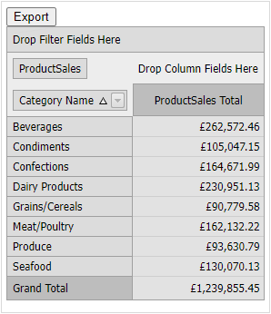

<!-- default badges list -->

<!-- default badges end -->
<!-- default file list -->
# Pivot Grid for Web Forms - How to Add Custom Header to an Exported PDF document

This example illustrates how to add a header to the document exported to PDF.

Run the project and click the **Export** button. The [ASPxPivotGrid](https://docs.devexpress.com/AspNet/DevExpress.Web.ASPxPivotGrid.ASPxPivotGrid) control exports its content to the PDF file, adding two lines of text to the document's header. The same approach enables you to add a custom text to the document's footer. To change the header's text, change the value of the corresponding [Text Brick](https://docs.devexpress.com/CoreLibraries/DevExpress.XtraPrinting.TextBrick).

## Files to Look At

- [Default.aspx](./CS/Default.aspx) (VB: [Default.aspx](./VB/Default.aspx))
- [Default.aspx.cs](./CS/Default.aspx.cs) (VB: [Default.aspx](./VB/Default.aspx))

## Documation

- [Pivot Grid Export](https://docs.devexpress.com/AspNet/114650/components/pivot-grid/export/export-overview)

## More Examples

- [Pivot Grid for Web Forms - How to add custom header and footer to an exported Excel document](https://github.com/DevExpress-Examples/data-aware-export-how-to-add-custom-header-and-footer-to-an-exported-excel-document-t355654)
